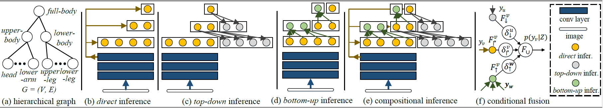

# Learning Compositional Neural Infomation Fusion for Human Parsing (ICCV19)

## Introduction
The algorithm is described in the [ICCV 2019 paper: Learning Compositional Neural Infomation Fusion for Human Parsing](https://openaccess.thecvf.com/content_ICCV_2019/papers/Wang_Learning_Compositional_Neural_Information_Fusion_for_Human_Parsing_ICCV_2019_paper.pdf). 
In this work, we propose to combine neural networks with the compositional hierarchy of human bodies for efficient and complete human parsing.

***

## Environment and installation
This repository is developed under **CUDA9.0** and **pytorch-0.4.1** in **python3.6**. Early versions of pytorch can be found [here](https://pytorch.org/previous-versions/). The required packages can be installed by:
```bash
pip install -r requirements.txt
```

## Structure of repo
````bash
$CompositionalHumanParsing
├── dataset
│   ├── list
├── doc
├── inplace_abn
│   ├── src
├── module
├── network
├── progress
````

## Running the code
1. Download the [pre-trained model](https://drive.google.com/file/d/1leUhWmHRHmpRtzSliTMsJVbrmOm8Fo4V/view?usp=sharing).
2. 
```bash
python evaluate.py --root <path to the dataset> --restore_from <path to the pre-traiend model>
```

***
## Citation
If you find this code useful, please cite our work with the following bibtex:
```
@inproceedings{wang2019learning,
  title={Learning compositional neural information fusion for human parsing},
  author={Wang, Wenguan and Zhang, Zhijie and Qi, Siyuan and Shen, Jianbing and Pang, Yanwei and Shao, Ling},
  booktitle={Proceedings of the IEEE International Conference on Computer Vision},
  pages={5703--5713},
  year={2019}
}
```
